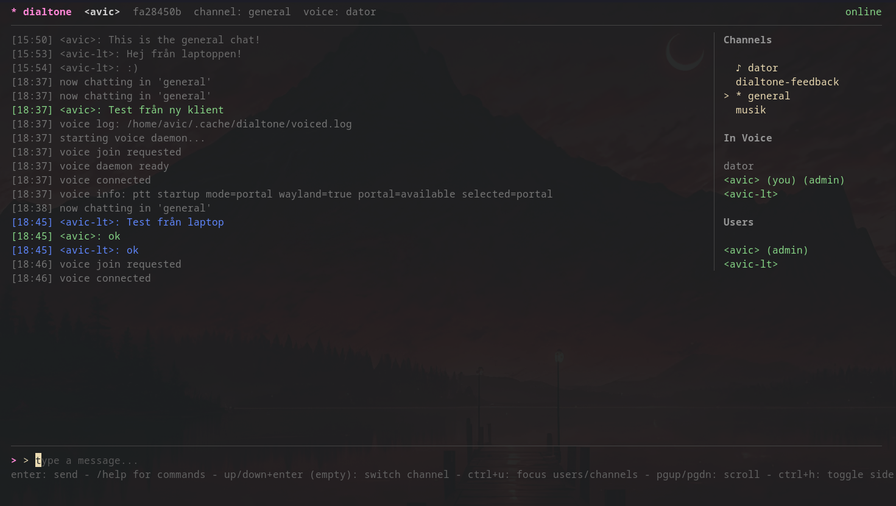

# dialtone

[](https://github.com/Avicted/dialtone/actions/workflows/ci.yml)
[](https://github.com/Avicted/dialtone/actions/workflows/ci.yml)

Dialtone is a realtime websocket chat with end-to-end encrypted message bodies and channel names.

Dialtone uses symmetric encryption for message bodies and channel names, and public key encryption to share those symmetric keys across devices. The server never sees plaintext message content or channel names, but it can see routing metadata required for the system to function. Usernames are sent in plaintext during login/register and stored only as a peppered hash (no plaintext usernames in the database).

## Client


## Who does what?

### Server admin (infrastructure owner)
You set up and operate Dialtone server infrastructure:
- Database + server process
- Server environment variables and secrets
- Invite generation
- TURN service for voice chat (required)

### Normal user (chat participant)
You run the client only:
- Connect to an existing Dialtone server
- Register using an invite token from the admin
- Log in and chat
- Optionally enable voice

## Server admin guide

### 1) Requirements
- Go 1.22+
- Postgres 16+
- Or docker

### 2) Configure server environment

Copy and edit environment variables:

```bash
cp .env.example .env
```

At minimum, set these to secure values:
- `DIALTONE_DB_URL`
- `DIALTONE_USERNAME_PEPPER`
- `DIALTONE_CHANNEL_KEY`
- `DIALTONE_ADMIN_TOKEN`

Generate random values:

```bash
openssl rand -base64 32
```

Use that output for `DIALTONE_USERNAME_PEPPER` and `DIALTONE_CHANNEL_KEY`, and set a strong random `DIALTONE_ADMIN_TOKEN`.

### 3) Run the server

```bash
export $(grep -v '^#' .env | xargs)
go run ./cmd/server
```

### 4) Create invite tokens for users

```bash
curl -s -X POST http://localhost:8080/server/invites \
  -H "X-Admin-Token: $DIALTONE_ADMIN_TOKEN"
```

Response includes `token` and `expires_at`. Share the token with a user so they can register.

### 5) (Optional) Production reverse proxy

You can place a reverse proxy (for example HAProxy) in front of Dialtone for TLS termination. Keep the backend connection private.

### 6) TURN for voice chat (required)

Dialtone voice uses WebRTC and requires TURN for connectivity.

Update `.env` TURN values:

```dotenv
TURN_USER=turn
TURN_PASS=replace-with-strong-random-password
TURN_REALM=turn.example.com
TURN_EXTERNAL_IP=<public_server_ip>
TURN_PORT=3478
TURN_TLS_PORT=5349
TURN_CERT_FILE=/etc/coturn/certs/fullchain.pem
TURN_KEY_FILE=/etc/coturn/certs/privkey.pem
TURN_MIN_PORT=49152
TURN_MAX_PORT=49252
```

Open firewall ports:
- `3478/tcp` and `3478/udp`
- `5349/tcp`
- `TURN_MIN_PORT`-`TURN_MAX_PORT` (UDP relay range)

Start coturn with the repo compose file:

```bash
docker compose up -d coturn
```

## Normal user guide

### 1) Requirements
- A running Dialtone server URL from your admin
- An invite token from your admin (for first-time registration)
- Go 1.22+ (if building from source)

### 2) Build the client

```bash
make build-client
```

### 3) Start the client

```bash
./bin/client --server https://dialtone.domain.com
```

Inside the TUI:
- New users register with the invite token
- Existing users log in with their credentials

### 4) (Optional) Enable voice

Voice chat requires TURN to be configured by the server admin.

Voice prerequisites:
- CGO enabled (`CGO_ENABLED=1`)
- `libopus` installed
- Audio backend (ALSA/PulseAudio/PipeWire on Linux; WASAPI on Windows)

Build voice daemon:

```bash
make build-dialtone-voiced
```

Run with PTT example:

```bash
./bin/client \
  --server https://dialtone.domain.com \
  --voice-debug \
  --voice-meter \
  --voice-ptt-backend portal \
  --voice-ptt caps
```

For voice chat, add the TURN settings provided by your admin:
- `--voice-turn`
- `--voice-turn-user`
- `--voice-turn-pass`

`--voice-ptt ""` disables push-to-talk and uses VAD.

## Client storage
Local client keys are stored under `~/.config/dialtone` on Linux and `%APPDATA%\\dialtone` on Windows. The keystore is encrypted with a passphrase you enter at login.

## Documentation
- [API](docs/API.md)
- [Encryption flow](docs/ENCRYPTION_FLOW.md)


## License
MIT
