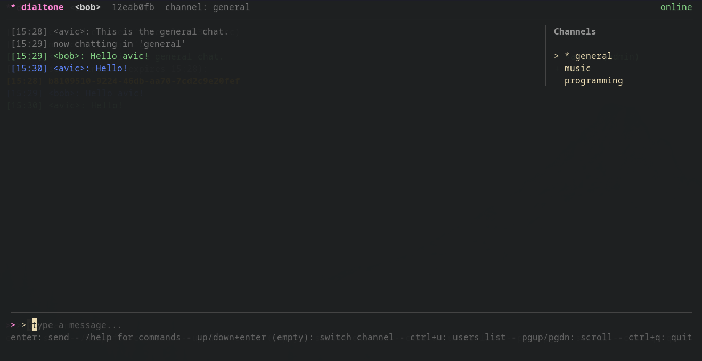

# dialtone

[](https://github.com/Avicted/dialtone/actions/workflows/ci.yml)
[](https://github.com/Avicted/dialtone/actions/workflows/ci.yml)

Dialtone is a realtime websocket chat with end-to-end encrypted message bodies and channel names.

Dialtone uses symmetric encryption for message bodies and channel names, and public key encryption to share those symmetric keys across devices. The server never sees plaintext message content or channel names, but it can see routing metadata required for the system to function. Usernames are sent in plaintext during login/register and stored only as a peppered hash (no plaintext usernames in the database).

## Client



## Quick start (server)

### Requirements
- Go 1.22+
- Postgres 16+

### Configure
Copy the example env file and set required values:

```bash
cp .env.example .env
```

Required variables:
- DIALTONE_DB_URL
- DIALTONE_USERNAME_PEPPER
- DIALTONE_CHANNEL_KEY
- DIALTONE_ADMIN_TOKEN

Generate secrets:

```bash
openssl rand -base64 32
```

Use the output for DIALTONE_USERNAME_PEPPER and DIALTONE_CHANNEL_KEY. Set a strong random value for DIALTONE_ADMIN_TOKEN.

### Run server

```bash
export $(grep -v '^#' .env | xargs)

go run ./cmd/server
```

## Voice (TURN/STUN)

Dialtone voice uses WebRTC and benefits from TURN for NAT traversal. A coturn service is included in docker-compose for local testing.

### Voice requirements

- CGO enabled (`CGO_ENABLED=1`)
- libopus installed (for Opus encoding)
- An audio backend (ALSA/PulseAudio/PipeWire on Linux; WASAPI on Windows)

### Configure TURN

Update `.env` with TURN credentials:

```
TURN_USER=turn
TURN_PASS=turnpass
TURN_REALM=dialtone
```

Start coturn:

```bash
docker compose up -d coturn
```

Run the voice daemon with TURN (and optional STUN) settings:

```bash
go run ./cmd/voiced \
  --server http://localhost:8080 \
  --token <dialtone-token> \
  --turn localhost:3478 \
  --turn-user $TURN_USER \
  --turn-pass $TURN_PASS
```

You can also provide STUN servers with `--stun`

Client auto-start (recommended for debugging):

```bash
./bin/client --voice-debug --voice-ptt "" --voice-meter --voice-vad 20
```

- `--voice-debug` writes voiced logs to a file (see the client UI for the log path).
- `--voice-ptt ""` disables push-to-talk and uses VAD (useful on Wayland).
- `--voice-vad <n>` lowers or raises the VAD threshold (lower = more sensitive).
- `--voice-meter` logs mic levels to the voiced log file once per second.
- `--voice-stun/--voice-turn/--voice-turn-user/--voice-turn-pass` are passed to the auto-started voice daemon.

### Create initial invite

```bash
curl -s -X POST http://localhost:8080/server/invites \
  -H "X-Admin-Token: $DIALTONE_ADMIN_TOKEN"
```

#### From within the dialtone docker container using curl:
```bash
export $(grep -v '^#' .env | xargs)

docker exec -it dialtone sh -c 'curl -X POST \
  -H "X-Admin-Token: $DIALTONE_ADMIN_TOKEN" \
  http://localhost:8080/server/invites'
```

The response includes token and expires_at. Use the token when registering a new user.

## Reverse proxy
You can place a reverse proxy (for example HAProxy) in front of the server to perform SSL/TLS termination. Keep the backend connection private and protected.

## Client storage
Local client keys are stored under ~/.config/dialtone on Linux and %APPDATA%\\dialtone on Windows. The keystore is encrypted with a passphrase you enter at login.

## Documentation
- [API](docs/API.md)
- [Encryption flow](docs/ENCRYPTION_FLOW.md)


## License
MIT
