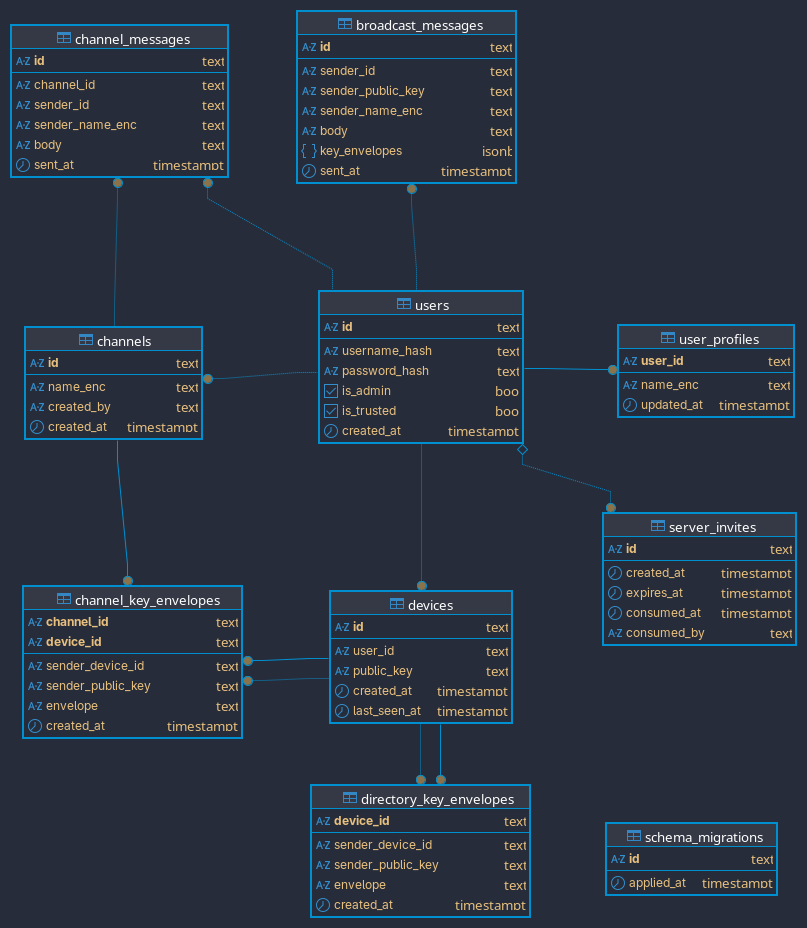

# Dialtone Server API

This document describes the HTTP and WebSocket API so new clients can be implemented.

## Database diagram


## Base URL

The server listens at `DIALTONE_LISTEN_ADDR`. Use HTTPS in production.

## Auth

Usernames are sent in plaintext during login/register so the server can authenticate. The server stores only a peppered hash (no plaintext usernames in the database).

All authenticated HTTP requests use a bearer token:

```
Authorization: Bearer <token>
```

WebSocket connections use the same header during the handshake.

## Errors

HTTP errors return JSON:

```json
{"error":"message"}
```

Common status codes:
- 400: invalid input
- 401: unauthorized
- 403: forbidden
- 404: not found
- 410: invite expired or consumed
- 500: server error

## Endpoints

### Health

`GET /health`

Returns `200 OK` with `ok`.

### Auth

`POST /auth/register`

Request:
```json
{
  "username": "string",
  "password": "string",
  "public_key": "base64",
  "invite_token": "string"
}
```

Response:
```json
{
  "token": "string",
  "user_id": "string",
  "device_id": "string",
  "expires_at": "RFC3339",
  "username": "string",
  "device_public_key": "base64",
  "is_admin": true,
  "is_trusted": true
}
```

`POST /auth/login`

Request:
```json
{
  "username": "string",
  "password": "string",
  "public_key": "base64"
}
```

Response is the same as register.

### Users

`POST /users`

Request:
```json
{ "username": "string" }
```

Response:
```json
{ "id": "string", "username": "string", "created_at": "RFC3339" }
```

### User Profiles (trusted users only)

`GET /users/profiles`

Response:
```json
{ "profiles": [ { "user_id": "string", "name_enc": "string", "updated_at": "RFC3339" } ] }
```

`POST /users/profiles`

Request:
```json
{ "name_enc": "string" }
```

Response:
```json
{ "status": "ok" }
```

### Devices

`POST /devices`

Request:
```json
{ "user_id": "string", "public_key": "base64" }
```

Response:
```json
{ "id": "string", "user_id": "string", "public_key": "base64", "created_at": "RFC3339" }
```

### Device keys

`GET /devices/keys?user_id=<id>`

Response:
```json
{ "user_id": "string", "keys": [ { "device_id": "string", "public_key": "base64" } ] }
```

`GET /devices/keys?all=1`

Response:
```json
{ "keys": [ { "user_id": "string", "device_id": "string", "public_key": "base64" } ] }
```

### Channels

`GET /channels`

Response:
```json
{ "channels": [ { "id": "string", "name_enc": "string", "created_by": "string", "created_at": "RFC3339" } ] }
```

`POST /channels`

Admin only.

Request:
```json
{ "name_enc": "string" }
```

Response:
```json
{ "channel": { "id": "string", "name_enc": "string", "created_by": "string", "created_at": "RFC3339" } }
```

`PATCH /channels`

Admin only.

Request:
```json
{ "channel_id": "string", "name_enc": "string" }
```

Response matches create.

`DELETE /channels?channel_id=<id>`

Admin only. Returns `204 No Content` on success.

### Channel messages

`GET /channels/messages?channel_id=<id>&limit=<n>`

Response:
```json
{
  "channel_id": "string",
  "messages": [
    {
      "id": "string",
      "channel_id": "string",
      "sender_id": "string",
      "sender_name_enc": "string",
      "body": "string",
      "sent_at": "RFC3339"
    }
  ]
}
```

### Channel key envelopes

`GET /channels/keys?channel_id=<id>`

Response:
```json
{
  "channel_id": "string",
  "device_id": "string",
  "sender_device_id": "string",
  "sender_public_key": "base64",
  "envelope": "string",
  "created_at": "RFC3339"
}
```

`POST /channels/keys`

Request:
```json
{
  "channel_id": "string",
  "envelopes": [
    {
      "device_id": "string",
      "sender_device_id": "string",
      "sender_public_key": "base64",
      "envelope": "string"
    }
  ]
}
```

Response:
```json
{ "status": "ok" }
```

### Directory key envelopes (trusted users only)

`GET /directory/keys`

- `200 OK` with envelope
- `204 No Content` if no envelope exists

Response:
```json
{
  "device_id": "string",
  "sender_device_id": "string",
  "sender_public_key": "base64",
  "envelope": "string",
  "created_at": "RFC3339"
}
```

`POST /directory/keys`

Request:
```json
{
  "envelopes": [
    {
      "device_id": "string",
      "sender_device_id": "string",
      "sender_public_key": "base64",
      "envelope": "string"
    }
  ]
}
```

Response:
```json
{ "status": "ok" }
```

### Presence

`POST /presence`

Request:
```json
{ "user_ids": ["string"] }
```

Response:
```json
{ "statuses": { "user_id": true }, "admins": { "user_id": false } }
```

### Server invites

`POST /server/invites`

Admin token header is required:

```
X-Admin-Token: <token>
```

Response:
```json
{ "token": "string", "expires_at": "RFC3339" }
```

## WebSocket

`GET /ws`

Requires `Authorization: Bearer <token>` header.

### Client -> Server messages

`channel.message.send`

```json
{
  "type": "channel.message.send",
  "channel_id": "string",
  "body": "encrypted message",
  "sender_name_enc": "encrypted sender name"
}
```

### Server -> Client events

`channel.message.new`
```json
{
  "type": "channel.message.new",
  "message_id": "string",
  "channel_id": "string",
  "sender": "string",
  "sender_name_enc": "string",
  "body": "string",
  "sent_at": "RFC3339"
}
```

`channel.updated`
```json
{
  "type": "channel.updated",
  "channel_id": "string",
  "channel_name_enc": "string"
}
```

`channel.deleted`
```json
{
  "type": "channel.deleted",
  "channel_id": "string"
}
```

`device.joined`
```json
{
  "type": "device.joined",
  "sender": "string",
  "device_id": "string"
}
```

`user.profile.updated`
```json
{
  "type": "user.profile.updated",
  "sender": "string"
}
```

`error`
```json
{
  "type": "error",
  "code": "string",
  "message": "string"
}
```
