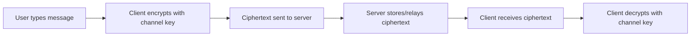
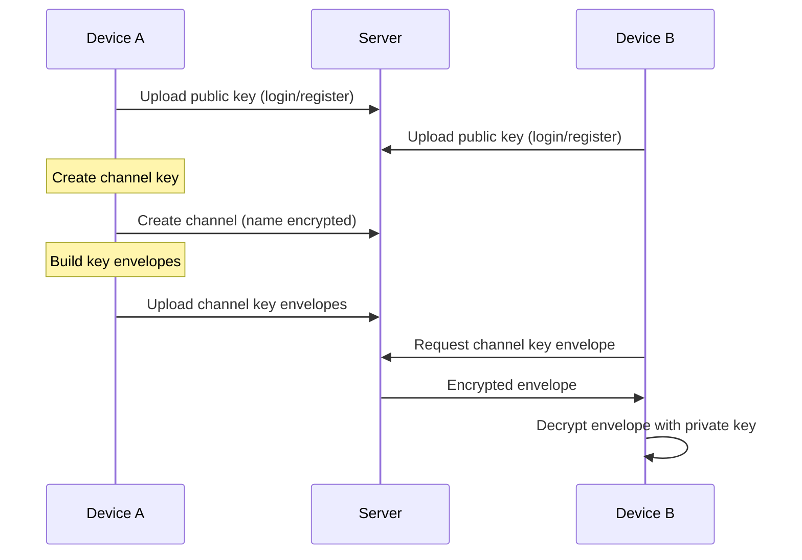

# Encryption Flow

This document describes the encryption flow in Dialtone, what is encrypted, what is not, and why. It is intended for public, technical documentation.

## Goals and threat model (short version)

- Protect message content and channel metadata from the server and network observers.
- Allow multi-device access by securely sharing symmetric keys via public key encryption.
- Accept that compromised client endpoints can read decrypted content.

## Core concepts and keys

- Device key pair (asymmetric)
  - Each device generates a long-term key pair locally.
  - Private key is stored locally in the encrypted keystore.
  - Public key is sent to the server for key sharing.

- Channel key (symmetric)
  - One per channel.
  - Encrypts message bodies and channel metadata (like channel names).

- Directory key (symmetric)
  - Encrypts directory/profile data (like usernames) stored server-side.

- Key envelopes
  - A symmetric key encrypted for a specific device using public key crypto.
  - Only the target device can decrypt it with its private key.

## Data flow overview

## Key lifecycle and sharing

## Local keystore encryption

The client stores sensitive materials (device private key, channel keys, directory key) locally. The keystore is encrypted with:

- scrypt KDF
- AES-256-GCM

A passphrase is required to decrypt the keystore. If the passphrase is wrong, content remains encrypted and keys cannot be used.

## What is encrypted

- Message bodies (channel key)
- Channel names (channel key)
- Sender display names in messages (channel key)
- Directory/profile data (directory key)
- Stored device keys and channel/directory keys in local keystore

## What is not encrypted (and why)

- User IDs, device IDs, channel IDs
  - Needed for routing, indexing, and access control.

- Timestamps and message metadata
  - Needed for ordering and display.

- Public keys
  - Must be public to enable key sharing.

- Network metadata
  - Standard transport metadata (IP, timing) is outside app-level encryption scope.

## Message encryption flow (detail)

1) Sender obtains channel key (local keystore or key envelope).
2) Client encrypts message body with the channel key.
3) Client encrypts sender display name with the channel key.
4) Client sends ciphertext to the server.
5) Receiver decrypts ciphertext using the same channel key.

## Directory/profile encryption flow (detail)

1) Device obtains directory key (local keystore or key envelope).
2) Client encrypts profile fields with directory key.
3) Server stores encrypted profile data.
4) Other devices decrypt profile fields using directory key.

## Failure and recovery behavior

- Missing channel key: client shows "<encrypted>" placeholders.
- Missing or invalid envelope: client cannot decrypt until a valid envelope is shared.
- Wrong keystore passphrase: keys are inaccessible, decryption fails.

## Security boundaries

- Protected against server-side inspection of message content and channel metadata.
- Not protected against compromised devices or malware on the client.
- Key sharing relies on trusted devices correctly distributing envelopes.

## Summary

Dialtone uses symmetric encryption for content and metadata, and public key encryption to share those symmetric keys across devices. The server never sees plaintext message content or channel names, but it can see routing metadata required for the system to function.
